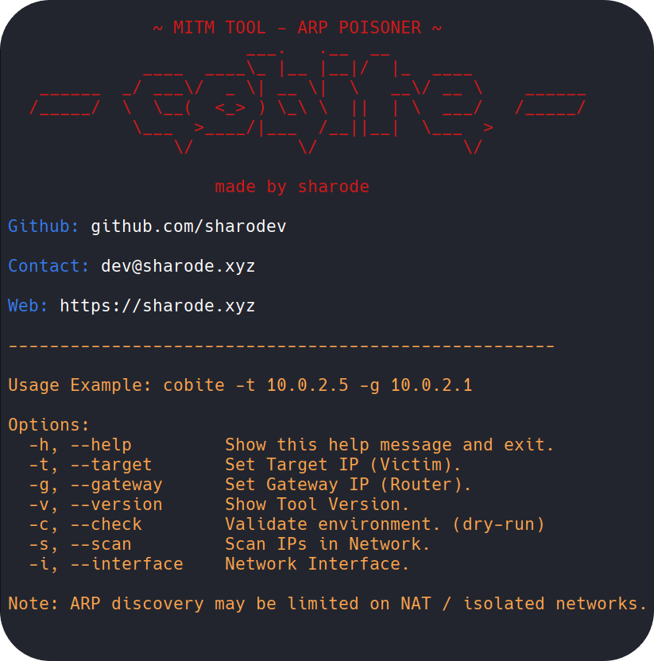

  

  

# Cobite Tool

Cobite is an **educational security research tool** focused on understanding
trust-based network behaviors and their defensive implications in controlled environments.

> This project is intended **strictly for educational, research, and lab-based testing**.
> Unauthorized usage against networks you do not own or have permission for is prohibited.

## Why did I build this tool?
I built this tool to better demonstrate how trust-based network protocols operate,
where their weaknesses lie, and how these weaknesses can be abused in real-world scenarios.

Cobite was specifically designed to illustrate a common man-in-the-middle attack pattern
in a controlled and educational manner, with the goal of improving understanding rather than exploitation.

## What can we learn from this tool?

This tool helps highlight the risks of intra-network attacks and the often-overlooked
assumptions made within local networks.

By analyzing this attack pattern, defenders can better understand how such threats occur
and develop more effective detection and mitigation strategies against malicious behavior.

## Key Concepts
- Modular framework design
- Clear separation between core logic and simulations
- Emphasis on safe execution and cleanup

## Use Cases
- Studying protocol trust assumptions
- Observing MITM-related behaviors in lab environments
- Developing defensive detection strategies

## About Tool
This publicly accessible repository does not contain any attack elements.

> Full lab builds are available **for authorized research purposes upon request**.

## Disclaimer
This tool is provided for **educational and defensive research purposes only**.
The author is not responsible for misuse.
